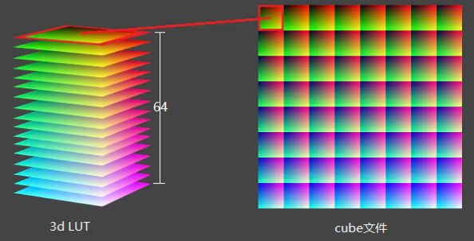

# Homework02-rendering

## LUT

A lut is a 3d image map one color to another, usually `16(width)*16(height)*16(sub image count)`, or `16*16*64(count)`, we should use trilinear interpolation to sample the lut texture.

Every sub image shares one same blue component, and in one sub image, the x axis means red, y axis means green.

TIPS: The top left sub image can't see any blue, because its blue components almost equals to 0, but the bottom right one looks very blue.
	
When we do sampling, color.b describes the z axis, representing which 16*16 sub image we will use. We should do twice sample on the two neighboring layers, which is floor(z) and ceil(z).

for example: if color.b * count = 15.5, then we sample on the 15th and 16th sub image, on the sub image we also do an interpolation for r and g.

NOTE: We should use nearest sampler not linear sampler when sampling this texture, because the color in this texture is pixelated, or say, discrete.

## SSAO

### Leaner depth

> https://blog.csdn.net/qjh5606/article/details/118675803  
> https://goudan-er.github.io/2016/d3d-projection/

Leaner depth is the depth in view space, but the depth in fragment shader we can access is in ndc space, which has done perspective transfomation and perspective divide. $Z_{ndc} = A + \frac{B}{z_{l}}$

NOTE: $Z_{ndc}$ is in $[-1, 1]$ in OpenGL, but is in $[0, 1]$ in D3D and Vulkan.

`uint` can't use as recursive variable.

WARNING: `subpassInput` can only read the same pixel's data from the last subpass, so it cannot be sampled! This means we can't use subpass to implement SSAO.